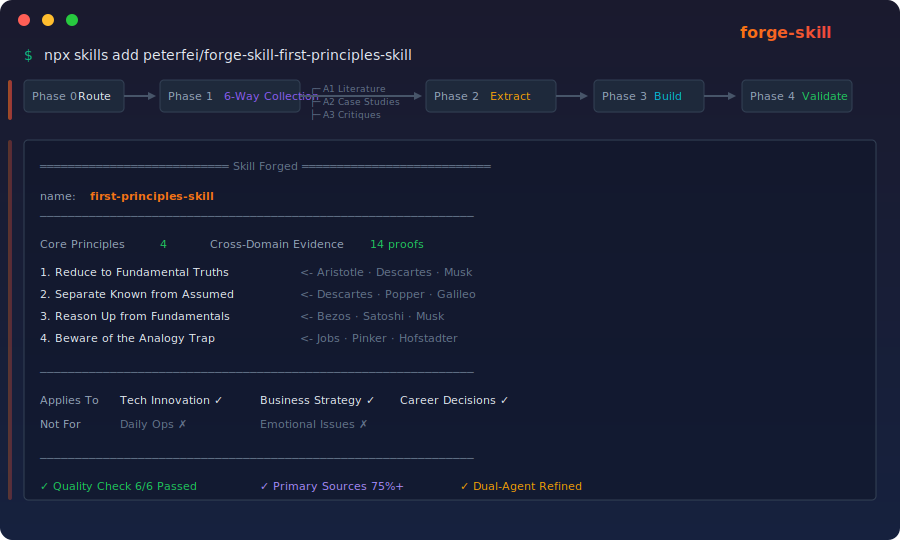

# Forge Skill — Forge Thinking Tools for Any Domain




> Don't role-play an expert. Forge an executable thinking tool.
> Input a methodology name or a vague need → auto deep research → structured extraction → generate a runnable AI Skill.

[中文](README.md)

---

## What is this?

Forge Skill is a thinking tool forge engine built on the [Agent Skills](https://skills.sh) open protocol. It transforms classic methodologies (First Principles, Systems Thinking, TRIZ, etc.) into executable AI Skills — making AI follow precise methodological processes instead of "role-playing experts."

**In one sentence**: Turn methodologies into cognitive Swiss Army knives you can invoke anytime.

## Core Features

- **Forge Engine**: Input a methodology name → 6-way parallel research → triple-verified extraction → generate executable Skill
- **Diagnostic Recommendation**: Not sure which method to use? Describe your problem, the engine recommends the best match
- **Misuse Detection**: Each Skill has a built-in misuse detector that proactively warns when a methodology is misapplied
- **Honest Boundaries**: Clearly labels method limitations — never pretends to be universal
- **Cross-Runtime**: Compatible with Claude Code, Codex CLI, Cursor, Gemini CLI, and 50+ runtimes
- **Multilingual**: Chinese, English, Japanese, Korean, and more

## Quick Start

```bash
# Install (requires an Agent Skills runtime, e.g., Claude Code)
npx skills add peterfei/forge-skill

# Direct forge (specific methodology)
> Forge a First Principles skill

# Diagnostic recommendation (vague need)
> My product retention keeps dropping, I don't know what to do
```

## Forge Pipeline

```
Phase 0   Entry Routing → Direct forge or diagnostic recommendation
Phase 1   Multi-source Collection → 6-way parallel research (literature/cases/criticism/cross-domain/tools/timeline)
Phase 1.5 Research Review → Show summary, confirm quality
Phase 2   Methodology Extraction → Triple-verified core principles + operational flow + applicability boundaries
Phase 2.5 Extraction Confirmation → Show summary, confirm direction
Phase 3   Skill Construction → Agentic Protocol + misuse detector + honest boundaries
Phase 4   Quality Validation → Known cases + edge cases + misuse detection verification
Phase 5   Dual Agent Refinement → Methodology review + usability review
```

## Methodology Library

> Click the methodology name to visit its standalone repo. Copy the install command to add it to your Agent Skills toolkit.

### Thinking Tools

| # | Methodology | Domain | One-line Description | Install |
|---|-------------|--------|---------------------|---------|
| F1 | [First Principles](https://github.com/peterfei/forge-skill-first-principles-skill) | Problem-solving/Innovation | Reduce to fundamental truths, reason up from physical limits | `npx skills add peterfei/forge-skill-first-principles-skill` |
| F2 | [Systems Thinking](https://github.com/peterfei/forge-skill-systems-thinking-skill) | Complex Systems | See overall structure and feedback loops through causal loop diagrams | `npx skills add peterfei/forge-skill-systems-thinking-skill` |
| F7 | [Feynman Learning Technique](https://github.com/peterfei/forge-skill-feynman-learning-skill) | Learning/Teaching | Test your understanding by teaching it to others | `npx skills add peterfei/forge-skill-feynman-learning-skill` |
| F12 | [Occam's Razor](https://github.com/peterfei/forge-skill-occams-razor-skill) | Decision/Simplification | Choose the solution with fewest assumptions given equal explanatory power | `npx skills add peterfei/forge-skill-occams-razor-skill` |
| F14 | [Second-Order Thinking](https://github.com/peterfei/forge-skill-second-order-thinking-skill) | Decision/Systems | Trace cascading higher-order consequences beyond immediate effects | `npx skills add peterfei/forge-skill-second-order-thinking-skill` |
| F16 | [Inversion](https://github.com/peterfei/forge-skill-inversion-skill) | Decision/Risk | Avoid failure by asking "what causes certain failure" then preventing it | `npx skills add peterfei/forge-skill-inversion-skill` |
| F18 | [Lateral Thinking](https://github.com/peterfei/forge-skill-lateral-thinking-skill) | Creativity/Problem-solving | Break fixed thinking patterns, find creative solutions from unconventional angles | `npx skills add peterfei/forge-skill-lateral-thinking-skill` |
| F19 | [Pareto Principle](https://github.com/peterfei/forge-skill-pareto-principle-skill) | Resource Focus/Optimization | Identify the vital few, concentrate resources for non-linear returns | `npx skills add peterfei/forge-skill-pareto-principle-skill` |

### Business & Strategy

| # | Methodology | Domain | One-line Description | Install |
|---|-------------|--------|---------------------|---------|
| F3 | [Growth Hacking](https://github.com/peterfei/forge-skill-growth-hacking-skill) | Product Growth/Retention | Data-driven experimentation cycles to find growth levers | `npx skills add peterfei/forge-skill-growth-hacking-skill` |
| F4 | [Lean Startup](https://github.com/peterfei/forge-skill-lean-startup-skill) | Startup Validation | Validate hypotheses rapidly with minimum viable products | `npx skills add peterfei/forge-skill-lean-startup-skill` |
| F8 | [Kaizen](https://github.com/peterfei/forge-skill-kaizen-skill) | Continuous Improvement | Small-step incremental optimization philosophy | `npx skills add peterfei/forge-skill-kaizen-skill` |
| F9 | [Premortem](https://github.com/peterfei/forge-skill-premortem-skill) | Risk Anticipation/Decision | Assume the project failed, reverse-engineer all possible causes | `npx skills add peterfei/forge-skill-premortem-skill` |
| F10 | [Five Forces](https://github.com/peterfei/forge-skill-five-forces-skill) | Competitive Strategy | Assess industry competitive landscape from five dimensions | `npx skills add peterfei/forge-skill-five-forces-skill` |
| F17 | [SWOT Analysis](https://github.com/peterfei/forge-skill-swot-skill) | Strategy/Planning | Cross-analyze strengths, weaknesses, opportunities, threats to formulate strategy | `npx skills add peterfei/forge-skill-swot-skill` |
| F20 | [Blue Ocean Strategy](https://github.com/peterfei/forge-skill-blue-ocean-strategy-skill) | Strategic Innovation | Create uncontested market space through value innovation | `npx skills add peterfei/forge-skill-blue-ocean-strategy-skill` |
| F21 | [Business Model Canvas](https://github.com/peterfei/forge-skill-business-model-canvas-skill) | Business Design/Startup | Describe business logic through 9 building blocks | `npx skills add peterfei/forge-skill-business-model-canvas-skill` |
| F22 | [Value Chain Analysis](https://github.com/peterfei/forge-skill-value-chain-skill) | Competitive Advantage/Cost | Decompose firm activities to identify cost and differentiation sources | `npx skills add peterfei/forge-skill-value-chain-skill` |
| F24 | [OKR](https://github.com/peterfei/forge-skill-okr-skill) | Goal Management/Organization Alignment | Focus on vital few, quantify measurable objectives and key results | `npx skills add peterfei/forge-skill-okr-skill` |

### Design & Innovation

| # | Methodology | Domain | One-line Description | Install |
|---|-------------|--------|---------------------|---------|
| F5 | [Design Thinking](https://github.com/peterfei/forge-skill-design-thinking-skill) | Product Design/Innovation | Five-step innovation framework starting from user empathy | `npx skills add peterfei/forge-skill-design-thinking-skill` |
| F11 | [Double Diamond](https://github.com/peterfei/forge-skill-double-diamond-skill) | Design Process/Problem Definition | Diverge→converge→diverge→converge structured process | `npx skills add peterfei/forge-skill-double-diamond-skill` |
| F15 | [JTBD](https://github.com/peterfei/forge-skill-jtbd-skill) | Product Design/Needs | People "hire" products to get jobs done, not buy features | `npx skills add peterfei/forge-skill-jtbd-skill` |

### Problem Solving

| # | Methodology | Domain | One-line Description | Install |
|---|-------------|--------|---------------------|---------|
| F6 | [TRIZ](https://github.com/peterfei/forge-skill-triz-skill) | Engineering/Contradiction Resolution | 40 invention principles for systematic resolution of technical contradictions | `npx skills add peterfei/forge-skill-triz-skill` |
| F13 | [Cynefin](https://github.com/peterfei/forge-skill-cynefin-skill) | Decision/Complexity | Classify problems into 5 domains, match decision strategy to domain | `npx skills add peterfei/forge-skill-cynefin-skill` |
| F14 | [Scenario Planning](https://github.com/peterfei/forge-skill-scenario-planning-skill) | Strategic Foresight/Uncertainty Decisions | Build multiple plausible future scenarios, reframe mental models for deep uncertainty | `npx skills add peterfei/forge-skill-scenario-planning-skill` |
| F23 | [5 Whys](https://github.com/peterfei/forge-skill-five-whys-skill) | Root Cause Analysis/Quality | Drill through surface symptoms via repeated questioning to locate systemic root causes | `npx skills add peterfei/forge-skill-five-whys-skill` |

## Ecosystem

Forge Skill is part of a three-project ecosystem:

```
nuwa-skill   → Distill human cognitive frameworks (WHO)
forge-skill  → Forge methodology tools (HOW)
darwin-skill → Optimize existing Skills (BETTER)
```

- [nuwa-skill](https://github.com/alchaincyf/nuwa-skill) — Distill notable thinkers' mindsets
- [darwin-skill](https://github.com/alchaincyf/darwin-skill) — Continuously evolve and optimize Skills

## License

[MIT](LICENSE)
